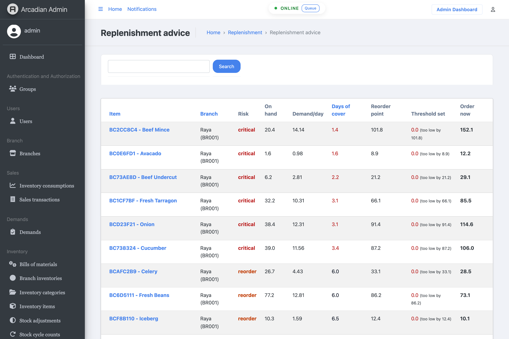
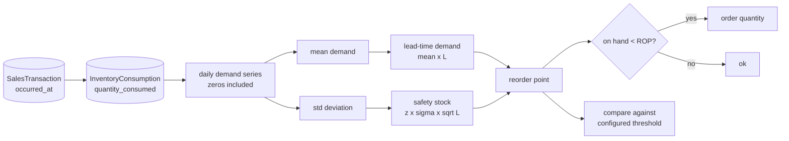

# Arcadian ERP

A Django ERP for a multi-branch food business: inventory, purchasing, sales,
warehouse transfers, demands and reporting, behind a Jazzmin admin.

The work here added the thing an inventory system is actually for — **knowing
what to reorder before you run out** — and fixed the reasons the project could
not be started from a clean clone.

---

## Run it

```bash
cp .env.example .env
docker compose up -d
docker compose run --rm web uv run python manage.py migrate
docker compose run --rm web uv run python manage.py setup_dev
docker compose run --rm web uv run python manage.py seed_demand_history
```

Then open **http://localhost:8500/admin** — `admin` / `admin1234`.

---

## Replenishment advice

Every stock row in this system carries a `minimum_threshold`: the level that
triggers a restock alert. It is a number a person types, it defaults to zero,
and in the seeded database it is **zero for all 40 items with sales history**.

A threshold of zero fires the alert when the shelf is already empty. That is
the same as having no alert.

The data needed to set it properly was already in the database — every sale
records what was consumed and when. `apps/replenishment/` derives it:



The screen opens on what runs out soonest. Beef Mince has 20.4 units, sells
14.1 a day, and will be gone in **1.4 days** — while a replacement order takes
five. Its configured threshold is 0.0; the history says it should be 101.8.



| | |
|---|---|
| **Lead-time demand** | what sells while a replacement is in transit — `mean × L` |
| **Safety stock** | cover for variability — `z × σ × √L` |
| **Reorder point** | lead-time demand + safety stock |
| **Days of cover** | `on hand ÷ mean daily demand` |
| **Order quantity** | enough to clear the reorder point plus one more lead time |

The `√L` is the part that is usually wrong. Demand over L days has L times the
*variance*, so its standard deviation grows with the square root of L, not with
L. There is a test that fails if that becomes linear.

### Why this is not a language model

The question "how much stock covers 95% of the demand arriving during a
five-day lead time" has a correct answer derivable from the history. Asking a
model to guess it would be less accurate, more expensive, and impossible to
audit — and a wrong answer means either a stockout or dead capital sitting on a
shelf.

Where a quantity has a closed form, the closed form is the right tool. The
judgment being demonstrated is choosing it.

What the system does not do — and where a model would genuinely help — is read
the supplier emails and delivery notes that would tell it the lead time is
actually seven days this month rather than five. Lead time is currently a
parameter someone passes in.

### API

```bash
GET /api/v1/replenishment/advice/?risk=critical&lead_time_days=5&service_level=0.95
```

```json
{
  "parameters": {"lead_time_days": 5, "service_level": 0.95, "history_days": 90},
  "count": 6,
  "results": [{
    "item": "Beef Mince", "risk": "critical",
    "on_hand": 20.44, "mean_daily_demand": 14.144, "stdev_daily_demand": 8.453,
    "days_of_cover": 1.4, "projected_stockout": "2026-09-01",
    "lead_time_demand": 70.72, "safety_stock": 31.09, "reorder_point": 101.81,
    "configured_threshold": 0.0, "threshold_error": 101.81,
    "suggested_order_quantity": 152.13
  }]
}
```

Lead time and service level are query parameters, not constants: a buyer who
knows a supplier is slow this month can ask what that does to the numbers.

---

## Honest limits of the analysis

- **Demand is assumed roughly normal.** For a slow-moving item selling zero
  units most days that is a poor fit, and the safety stock will be wrong. Below
  five days with any demand the code reports `unknown` rather than a number.
- **`suggested_order_quantity` is not an economic order quantity.** EOQ needs
  an ordering cost and a holding cost; this system records neither. Inventing
  them to make the formula fit would produce a number that looks rigorous and
  means nothing.
- **Lead time is a parameter, not an observation.** The purchase orders needed
  to measure it are in the database; using them is the obvious next step.
- **No seasonality.** A 90-day mean will under-order into a known busy period.
- **335 of 375 items have no sales history at all** in the seeded data, and are
  excluded from the screen. On real data that ratio is the first thing to
  investigate.

---

## What was broken

**The project could not be seeded.** `manage.py setup_dev` died with
`value too long for type character varying(8)`. `seed_data.py` set
`barcode=f"BC-{sku_base}"` — an SKU-length string — into a `varchar(8)`, while
the model right next to it already had a correct generator producing exactly 8
characters. The seed now leaves the field blank and lets the model fill it.

There is a `delete_long_barcodes` management command in the repository, which
suggests someone hit this before and wrote a cleanup instead of fixing the
cause.

**Demand history could not be read from the obvious column.**
`InventoryConsumption.timestamp` is `auto_now_add`, so it records when the row
was written, not when the stock was consumed. In the seeded database:

```
consumption.timestamp range: 2026-08-31 14:41:44.72 -> 2026-08-31 14:41:44.81
sale.occurred_at range     : 2026-03-05          -> 2026-08-13
```

Five months of sales, every consumption stamped inside the same tenth of a
second. Any analysis using that column concludes all demand happened at once.
The analysis reads `sales_transaction.occurred_at` instead, and a test pins it.

**There was no test suite.** Seven `tests.py` files contained nothing but
Django's boilerplate import — three of six lines, three of one line, and one
empty file.

**The admin screen would have been an N+1.** Six derived columns per row, each
issuing its own query. Profiles are computed once per request and cached, and
the ranking is a SQL annotation rather than a Python sort — an admin cannot
order by a value computed in a `list_display` callable.

---

## Tests

```bash
docker compose run --rm web uv run python manage.py test
```

27 tests. Most construct a `DemandProfile` directly rather than going through
the database: the arithmetic decides whether a buyer over-orders or runs out,
and it should be checkable without fixtures.

- **The formulas** — that safety stock scales with `√L`, that steady demand
  needs less of it than erratic demand, that an order lifts stock past the
  reorder point rather than exactly to it.
- **The honest cases** — that an item with no demand reports `None` days of
  cover rather than zero (which would rank a dead item as the most urgent
  thing on the screen), and that too little history reports `unknown` rather
  than a safety stock derived from two data points.
- **The queries** — that demand is dated by the sale rather than by the row
  write, and that days with no sales are counted as zeros. Dropping them would
  inflate both the mean and the variance: an item sold on 3 of 90 days would
  look like steady daily demand.

---

## Layout

```
apps/
├── replenishment/     reorder points, safety stock, risk ranking   ← added
│   ├── service.py         the analysis
│   ├── admin.py           the buyer's screen
│   ├── views.py           the API
│   └── management/commands/seed_demand_history.py
├── inventory/         items, categories, branch stock
├── sales/             POS transactions and inventory consumption
├── purchases/         purchase orders and goods receipts
├── warehouse/         warehouse stock, transactions, requests
├── transfers/         branch-to-branch movement
├── demands/           branch replenishment requests
└── reports/
```

## Configuration

| Variable | Default | Purpose |
|---|---|---|
| `WEB_PORT` | `8500` | Host port for the admin and API |
| `DB_NAME` / `DB_USER` / `DB_PASSWORD` | see `.env.example` | Postgres |
| `SECRET_KEY` | — | Required |
| `DEBUG` | `True` | |

Replenishment defaults (`lead_time_days=5`, `service_level=0.95`,
`history_days=90`) live in `apps/replenishment/service.py` and are overridable
per request.
